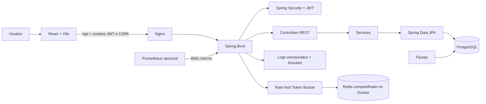

# Arquitetura do SGFL

O SGFL é uma aplicação web em três partes: interface React, API REST em Spring Boot e banco PostgreSQL. O frontend acessa o backend por HTTP; somente o backend conversa com o banco.

## Frontend

O frontend em `sgfl-frontend/` usa React, Vite e Axios. `App.jsx` controla a sessão e compõe login, dashboard de frota/entregas e gestão comercial. `api.js` centraliza chamadas Axios, cookies e tratamento de respostas 401. A busca paginada de entregas vive no hook `useEntregaList.js`, separado do dashboard. `Dashboard.jsx` compõe as telas de frota e entregas; `GestaoComercial.jsx` implementa clientes, produtos e pedidos; `CadastroRecursos.jsx` cuida dos cadastros de frota.

Em desenvolvimento o Vite serve a interface. No Docker, o build estático é servido por Nginx, que também encaminha `/api/` ao backend.

## Backend

O backend fica em `src/main/java/com/logitech/sgfl/` e organiza o código por responsabilidade:

| Pacote | Responsabilidade |
|---|---|
| `controller/` | Endpoints HTTP para autenticação, frota, entregas, clientes, produtos e pedidos |
| `service/` | Casos de uso e regras de negócio |
| `repository/` | Consultas e persistência via Spring Data JPA |
| `me/` | Entidades JPA do domínio |
| `dto/` | Contratos de entrada e validação |
| `security/` | Spring Security, JWT, autenticação e autorização |
| `exceptions/` | Exceções de domínio e tratamento uniforme de erros |
| `ratelimit/` | Limite de requisições por IP |
| `logging/` | Logs estruturados, request ID e metadados HTTP |
| `config/` | Configuração e bootstrap opcional do administrador |

O domínio comercial inclui `Cliente`, `Produto`, `Estoque`, `Pedido` e `ItemPedido`. O domínio logístico inclui `Veiculo` (com `Caminhao` e `Furgao`), `Motorista` e `Entrega`. Pedidos reservam estoque em transação; entregas validam capacidade, CNH e disponibilidade de recursos.

Listagens de clientes, produtos, pedidos, motoristas, veículos e entregas usam páginas de 20 itens por padrão, aceitam `page` e limitam páginas a 100 itens. Motoristas e veículos também aceitam `q` para filtrar por nome/CPF ou placa/modelo. Respostas de listagem usam um contrato paginado; DTOs mantêm a forma da API separada das entidades JPA.

## Persistência e integridade

PostgreSQL é o banco de execução. Flyway aplica scripts versionados em `src/main/resources/db/migration/`; Hibernate valida o esquema (`ddl-auto=validate`). Constraints e índices no banco reforçam unicidade e impedem alocações simultâneas de veículo ou motorista em entregas em trânsito.

## Segurança e operação

O login público configura JWT em cookie `HttpOnly`; as demais rotas exigem autenticação. Spring Security aplica autorização por perfil e BCrypt protege as senhas. Um cookie CSRF separado protege operações mutáveis e o frontend o envia pelo header `X-XSRF-TOKEN`. CORS permite somente origens explicitamente configuradas. Logs estruturados incluem request ID para rastrear chamadas.

O JWT do navegador fica em cookie `HttpOnly`, `SameSite=Lax`, com validade alinhada à expiração do token. Defina `APP_COOKIE_SECURE=true` quando o tráfego externo usar HTTPS. No Compose, o rate limiter usa token buckets atômicos no Redis, compartilhados entre instâncias; a distribuição portátil mantém buckets em memória para uma única instância. Se o Redis falhar, o backend fecha as chamadas protegidas com `503` em vez de desativar a proteção.

O `docker-compose.yml` sobe PostgreSQL, Redis, backend e frontend/Nginx. O backend executa health/readiness e Prometheus em uma porta de gerenciamento interna (`8081`), sem publicação no host. O perfil opcional `observability` sobe Prometheus em `localhost:9090` com regras iniciais para disponibilidade, erros 5xx e saturação do pool JDBC. Segredos são fornecidos por variáveis de ambiente; Dependabot acompanha Maven, npm, imagens Docker e GitHub Actions.

Scripts para backup e restauração estão em `scripts/`; a rotina faz backup de segurança antes de restaurar e pede confirmação explícita. Veja `docs/OPERATIONS.md` para limites e procedimentos. O backup deve ser copiado para armazenamento externo protegido e a restauração testada periodicamente.

## Estado da documentação

Este documento descreve os módulos encontrados no código atual. O `README.md` contém instruções de configuração e execução; consulte ambos para entender a arquitetura e operar o projeto.
